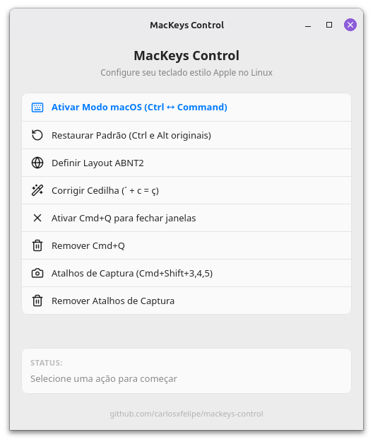

# MacKeys Control - Deno Desktop



MacKeys Control is a utility designed to seamlessly replicate the macOS keyboard
experience on Linux. It was created out of the need to use a Logitech K380s
keyboard on both operating systems while maintaining the exact same muscle
memory, shortcuts (like swapping Ctrl/Command or using Cmd+Q), and layout
behaviors across both macOS and Linux environments.

## Requirements

- [Deno](https://deno.land/) installed on your system.
- [Deno extension](https://marketplace.visualstudio.com/items?itemName=denoland.vscode-deno)
  for VS Code (recommended).

## Development

```sh
deno task dev
```

## Build

To compile the application and generate a standalone `.AppImage` file for Linux
distribution, run:

```sh
deno task build
```

This single command will:

1. Compile the Deno application natively.
2. Bundle the required icons.
3. Generate a `MacKeysControl-v1.0.0-x86_64.AppImage` (with the current version)
   in your root directory.

You can then run the AppImage directly, or execute the raw binary inside the
`MacKeysControl/` folder for testing.

## Code Formatting

This project uses Deno's built-in formatter. To ensure consistent code style
across the project, run:

```sh
deno fmt
```

Formatting rules and file exclusions are managed in [`deno.json`](./deno.json).

### VS Code Setup

If you use VS Code and have the **Prettier** extension installed, it may
conflict with Deno's formatter. To use Deno's formatter automatically on save,
add the following to your `.vscode/settings.json`:

```json
"[typescript]": {
  "editor.defaultFormatter": "denoland.vscode-deno"
},
"[typescriptreact]": {
  "editor.defaultFormatter": "denoland.vscode-deno"
}
```

## License

This project is licensed under the MIT License - see the [LICENSE](LICENSE) file
for details.
